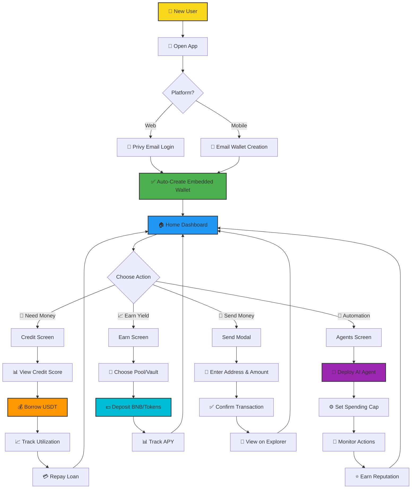
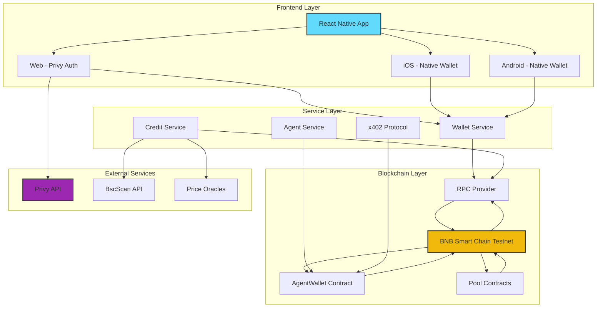

# Proteus Finance 🏦

A next-generation decentralized finance (DeFi) super-app with AI-powered treasury management, autonomous agents, and cross-platform support. Built with React Native, Expo, Privy wallet integration, and smart contracts on BNB Smart Chain.


## 🌟 Overview

Proteus Finance is a comprehensive DeFi platform that combines traditional financial services with cutting-edge blockchain technology and AI-powered automation. Users can manage credit, earn yield, deploy autonomous treasury agents, and execute transactions seamlessly across web and mobile platforms.

## 🗺️ User Journey



### Journey Highlights

1. **Onboarding (30 seconds)**
   - Email-based wallet creation
   - No seed phrases or complex setup
   - Instant access to DeFi features

2. **Credit Access (2 minutes)**
   - Automatic credit scoring
   - Borrow up to $500 USDT
   - Dynamic APR based on risk profile

3. **AI Agent Deployment (3 minutes)**
   - Deploy autonomous treasury agent
   - Set spending caps and policies
   - Agent executes actions 24/7

4. **Earning Yield (1 minute)**
   - Add liquidity to pools
   - Deposit to savings vaults
   - Track real-time APY

## ✨ Key Features

### 💰 **Multi-Wallet Support**
- **Privy Integration**: Email-based authentication with embedded wallets
- **Cross-Platform**: Seamless wallet experience on web and mobile
- **Secure Storage**: Private keys stored securely on-device (mobile) or via Privy (web)
- **BNB Smart Chain**: Native support for BNB Testnet with mainnet-ready architecture

### 🤖 **AI Treasury Agents**
- **Autonomous Management**: Deploy AI agents to manage your treasury 24/7
- **Policy Enforcement**: x402 protocol integration for spend limits and risk controls
- **Smart Contracts**: On-chain agent wallets with reputation scoring
- **Micropayments**: Automated recurring payments and DeFi actions
- **Reputation System**: Agents earn trust scores based on successful actions

### 💸 **Credit System**
- **Dynamic Credit Scoring**: On-chain credit evaluation based on wallet history
- **Flexible Borrowing**: Borrow USDT against your credit limit
- **Risk-Based APR**: Interest rates from 8-18% based on risk profile
- **Real-Time Tracking**: Monitor credit utilization and payment history
- **Smart Repayment**: Easy repayment with automatic credit restoration

### 📈 **Earn & Invest**
- **Liquidity Pools**: Provide liquidity to BNB-USDT and other pools
- **Savings Vaults**: Earn passive yield on stablecoins (USDC, USDT, FDUSD)
- **Live Deposits**: Real on-chain transactions to deployed pool contracts
- **APY Tracking**: Monitor returns across all investment positions
- **Risk Indicators**: Clear risk levels for each investment option

### 🎨 **Beautiful UI/UX**
- **Binance Gold Theme**: Professional gradient design system
- **Bottom Sheet Modals**: Native mobile interactions
- **Responsive Charts**: Real-time cashflow and portfolio visualization
- **Quick Actions**: Send, Receive, Swap, and Quick Pay at your fingertips
- **Dark Mode**: Elegant dark theme optimized for crypto trading

## 🏗️ Architecture

### System Architecture Diagram



### Architecture Layers

#### **1. Frontend Layer (React Native + Expo)**
- **Cross-Platform UI**: Single codebase for iOS, Android, and Web
- **State Management**: React hooks and context for global state
- **Navigation**: Tab-based navigation with modal overlays
- **Responsive Design**: Adapts to different screen sizes and platforms

#### **2. Service Layer**
- **Wallet Service**: Manages wallet creation, authentication, and key storage
- **Credit Service**: Calculates credit scores, manages borrowing/repayment
- **Agent Service**: Deploys and monitors AI treasury agents
- **x402 Protocol**: Policy enforcement and transaction validation

#### **3. Blockchain Layer**
- **Smart Contracts**: Solidity contracts deployed on BNB Smart Chain
- **RPC Communication**: Direct interaction with blockchain nodes
- **Transaction Management**: Signing, broadcasting, and monitoring transactions
- **Event Listening**: Real-time updates from on-chain events

#### **4. External Integrations**
- **Privy**: Embedded wallet infrastructure and authentication
- **BscScan**: Transaction history and wallet analytics
- **Price Feeds**: Real-time token pricing for USD conversions

### **Project Structure**
```
├── App.tsx                          # Main app entry with Privy provider
├── src/
│   ├── screens/
│   │   ├── HomeScreen.tsx           # Dashboard with balance & quick actions
│   │   ├── CreditScreen.tsx         # Borrow/repay credit management
│   │   ├── AgentsScreen.tsx         # AI agent deployment & monitoring
│   │   ├── EarnScreen.tsx           # Liquidity pools & savings vaults
│   │   ├── SendScreen.tsx           # Send BNB/tokens modal
│   │   ├── FXPayScreen.tsx          # Quick payment interface
│   │   └── LandingScreen.tsx        # Onboarding splash screen
│   ├── components/
│   │   ├── Card.tsx                 # Reusable card component
│   │   ├── Button.tsx               # Button with variants
│   │   ├── Badge.tsx                # Status badges
│   │   ├── Sheet.tsx                # Bottom sheet modals
│   │   └── Input.tsx                # Form inputs
│   ├── services/
│   │   ├── walletService.ts         # Wallet management
│   │   ├── creditService.ts         # Credit scoring & borrowing
│   │   ├── agentWalletService.ts    # Agent contract interactions
│   │   ├── x402Service.ts           # x402 protocol integration
│   │   └── treasuryAgent.ts         # AI agent logic
│   └── theme/
│       └── colors.ts                # Design system tokens
├── contracts/
│   └── AgentWallet.sol              # Treasury agent wallet contract
├── scripts/
│   └── deployAgentWallet.js         # Deployment scripts
└── hardhat.config.cjs               # Hardhat configuration
```

### **Deployed Contracts (BNB Testnet)**
- **AgentWallet**: `0xF9c36b4fBA23F515b1ae844642F81DC0aDdf6AF6`
- **BNB-USDT Pool**: `0xF9c36b4fBA23F515b1ae844642F81DC0aDdf6AF6`

### **Data Flow**

1. **User Authentication**
   ```
   User → Privy/Native Auth → Wallet Creation → Private Key Storage
   ```

2. **Credit Borrowing**
   ```
   User → Credit Screen → Calculate Score → Borrow Request → Smart Contract → USDT Transfer
   ```

3. **AI Agent Action**
   ```
   Agent Brain → Policy Check (x402) → Execute Action → Smart Contract → On-Chain Transaction
   ```

4. **Pool Deposit**
   ```
   User → Earn Screen → Select Pool → Sign Transaction → Pool Contract → Liquidity Added
   ```

## 🚀 Getting Started

### Prerequisites
- Node.js 18+ and npm/yarn
- Expo CLI (`npm install -g expo-cli`)
- iOS Simulator (Mac) or Android Emulator
- MetaMask or Privy account for web

### Installation

1. **Clone the repository**
```bash
git clone https://github.com/Adityaakr/Proteus-Finance.git
cd Proteus-Finance
```

2. **Install dependencies**
```bash
npm install
```

3. **Set up environment variables**
```bash
cp .env.example .env
# Add your Privy App ID and other credentials
```

4. **Run the app**

**For Web:**
```bash
npm run web
```

**For Mobile (iOS):**
```bash
npm run ios
```

**For Mobile (Android):**
```bash
npm run android
```

**Development Server:**
```bash
npm start
# Then scan QR code with Expo Go app
```

## 📱 Platform Support

| Feature | Web | iOS | Android |
|---------|-----|-----|---------|
| Wallet Connect | ✅ Privy | ✅ Native | ✅ Native |
| Send/Receive | ✅ | ✅ | ✅ |
| Credit System | ✅ | ✅ | ✅ |
| AI Agents | ✅ | ✅ | ✅ |
| Earn Pools | ✅ | ✅ | ✅ |
| Charts | ✅ | ✅ | ✅ |

## 🔧 Technology Stack

### **Frontend**
- **React Native** - Cross-platform mobile framework
- **Expo** - Development platform and tooling
- **TypeScript** - Type-safe JavaScript
- **Privy** - Embedded wallet authentication
- **ethers.js** - Ethereum library for blockchain interactions
- **react-native-chart-kit** - Data visualization

### **Blockchain**
- **Solidity** - Smart contract language
- **Hardhat** - Development environment
- **BNB Smart Chain** - Layer 1 blockchain (Testnet)
- **ethers.js** - Contract deployment and interaction

### **Design**
- **Ionicons** - Icon system
- **expo-linear-gradient** - Gradient backgrounds
- **Custom Design System** - Binance-inspired gold theme

## 📦 Open-Source Dependencies

### Core Framework
| Package | Version | License | Purpose |
|---------|---------|---------|---------|
| `react` | ^19.1.0 | MIT | UI library |
| `react-native` | ^0.81.5 | MIT | Mobile framework |
| `expo` | ~54.0.22 | MIT | Development platform |
| `typescript` | ~5.9.2 | Apache-2.0 | Type safety |

### Blockchain & Web3
| Package | Version | License | Purpose |
|---------|---------|---------|---------|
| `ethers` | ^6.15.0 | MIT | Ethereum interactions |
| `@privy-io/react-auth` | ^3.7.0 | MIT | Wallet authentication (Web) |
| `@privy-io/expo` | ^0.60.2 | MIT | Wallet authentication (Mobile) |
| `viem` | ^2.39.0 | MIT | Ethereum utilities |
| `buffer` | ^6.0.3 | MIT | Buffer polyfill for web |

### UI & Design
| Package | Version | License | Purpose |
|---------|---------|---------|---------|
| `@expo/vector-icons` | ^15.0.3 | MIT | Icon library (Ionicons) |
| `expo-linear-gradient` | ^15.0.7 | MIT | Gradient backgrounds |
| `react-native-chart-kit` | ^6.12.0 | MIT | Data visualization |
| `react-native-svg` | 15.12.1 | MIT | SVG rendering |
| `@react-native-community/slider` | ^5.1.0 | MIT | Slider component |

### Storage & Security
| Package | Version | License | Purpose |
|---------|---------|---------|---------|
| `@react-native-async-storage/async-storage` | ^2.2.0 | MIT | Persistent storage |
| `react-native-keychain` | ^10.0.0 | MIT | Secure key storage |
| `react-native-biometrics` | ^3.0.1 | MIT | Biometric authentication |
| `react-native-get-random-values` | ~1.11.0 | MIT | Crypto random values |

### Navigation & Utilities
| Package | Version | License | Purpose |
|---------|---------|---------|---------|
| `@react-navigation/native` | ^7.1.19 | MIT | Navigation framework |
| `@react-navigation/bottom-tabs` | ^7.8.1 | MIT | Tab navigation |
| `react-native-webview` | 13.15.0 | MIT | WebView component |
| `@react-native-community/netinfo` | 11.4.1 | MIT | Network status |
| `expo-constants` | ^18.0.10 | MIT | App constants |

### Smart Contract Development
| Package | Version | License | Purpose |
|---------|---------|---------|---------|
| `hardhat` | ^2.27.0 | MIT | Smart contract framework |
| `@nomicfoundation/hardhat-toolbox` | ^3.0.0 | MIT | Hardhat plugins bundle |
| `@nomicfoundation/hardhat-ethers` | ^4.0.3 | MIT | Ethers.js integration |
| `dotenv` | ^17.2.3 | BSD-2-Clause | Environment variables |

### Total Dependencies
- **Production**: 41 packages
- **Development**: 11 packages
- **All Open Source**: MIT, Apache-2.0, BSD licenses
- **No Proprietary Dependencies**: Fully open-source stack

## 🎯 Core Functionality

### **1. Wallet Management**
- Create wallet with email (Privy on web, native on mobile)
- View balance in BNB and USD
- Copy address and view on explorer
- Logout and session management

### **2. Credit Operations**
```typescript
// Calculate credit score
const score = await creditService.calculateCreditScore(walletAddress);

// Borrow USDT
const txHash = await creditService.borrow(walletAddress, amount, sendTransaction);

// Repay loan
await creditService.repay(walletAddress, amount, sendTransaction);
```

### **3. AI Agent Deployment**
```typescript
// Deploy agent wallet
const agentAddress = await agentWalletService.deployAgentWallet(
  userAddress,
  spendingCap
);

// Execute autonomous action
await agentWalletService.executeAction(agentAddress, target, value, data);
```

### **4. Earn & Invest**
```typescript
// Add liquidity to pool
const txHash = await sendTransaction({
  to: poolAddress,
  value: ethers.parseEther(amount).toString(),
  chainId: 97
});
```

## 🔐 Security

- **Private Key Storage**: Secure Keychain (iOS), Keystore (Android), Privy (Web)
- **Biometric Authentication**: Face ID / Touch ID support on mobile
- **Smart Contract Auditing**: Contracts follow OpenZeppelin standards
- **Spending Caps**: Agent wallets have configurable limits
- **Policy Enforcement**: x402 protocol for transaction validation

## 📊 Smart Contract Features

### **AgentWallet.sol**
- Receive and hold BNB
- Execute actions with spending cap enforcement
- Reputation scoring system (0-100)
- Credit allocation tracking
- Event emission for monitoring
- Owner-only administrative functions

## 🚀 Deployment Instructions

### **1. Deploy Smart Contracts**

#### Prerequisites
- BNB Testnet account with test BNB (get from [faucet](https://testnet.bnbchain.org/faucet-smart))
- Private key for deployment account

#### Steps

1. **Configure Hardhat**
```bash
# Create .env file
echo "PRIVATE_KEY=your_private_key_here" > .env
echo "BNB_TESTNET_RPC=https://data-seed-prebsc-1-s1.binance.org:8545/" >> .env
```

2. **Compile Contracts**
```bash
npx hardhat compile
```

3. **Deploy AgentWallet Contract**
```bash
npx hardhat run scripts/deployAgentWallet.js --network bnbTestnet
```

4. **Verify Contract on BscScan**
```bash
npx hardhat verify --network bnbTestnet DEPLOYED_CONTRACT_ADDRESS "OWNER_ADDRESS" "SPENDING_CAP"
```

5. **Update Contract Addresses**
```bash
# Update .env with deployed addresses
echo "AGENT_WALLET_ADDRESS=0x..." >> .env
echo "POOL_ADDRESS=0x..." >> .env
```

### **2. Deploy Web Application**

#### Option A: Vercel (Recommended)

1. **Install Vercel CLI**
```bash
npm install -g vercel
```

2. **Build for Web**
```bash
npm run web:build
```

3. **Deploy**
```bash
vercel --prod
```

4. **Configure Environment Variables**
- Go to Vercel Dashboard → Project Settings → Environment Variables
- Add: `PRIVY_APP_ID`, `BNB_TESTNET_RPC`, `AGENT_WALLET_ADDRESS`

#### Option B: Netlify

1. **Build**
```bash
npm run web:build
```

2. **Deploy**
```bash
npx netlify deploy --prod --dir=web-build
```

#### Option C: GitHub Pages

1. **Install gh-pages**
```bash
npm install --save-dev gh-pages
```

2. **Add to package.json**
```json
{
  "scripts": {
    "predeploy": "npm run web:build",
    "deploy": "gh-pages -d web-build"
  },
  "homepage": "https://yourusername.github.io/Proteus-Finance"
}
```

3. **Deploy**
```bash
npm run deploy
```

### **3. Deploy Mobile Apps**

#### iOS Deployment (TestFlight)

1. **Configure EAS**
```bash
npm install -g eas-cli
eas login
eas build:configure
```

2. **Build for iOS**
```bash
eas build --platform ios --profile production
```

3. **Submit to TestFlight**
```bash
eas submit --platform ios
```

4. **App Store Connect**
- Go to [App Store Connect](https://appstoreconnect.apple.com)
- Add testers to TestFlight
- Submit for App Store review

#### Android Deployment (Google Play)

1. **Build for Android**
```bash
eas build --platform android --profile production
```

2. **Submit to Google Play**
```bash
eas submit --platform android
```

3. **Google Play Console**
- Go to [Google Play Console](https://play.google.com/console)
- Create internal testing track
- Upload APK/AAB
- Submit for review

### **4. Environment Configuration**

#### Production Environment Variables

**Web (.env.production)**
```bash
PRIVY_APP_ID=your_production_privy_app_id
BNB_MAINNET_RPC=https://bsc-dataseed.binance.org/
AGENT_WALLET_ADDRESS=0x...
POOL_ADDRESS=0x...
SENTRY_DSN=your_sentry_dsn
```

**Mobile (app.json)**
```json
{
  "expo": {
    "extra": {
      "privyAppId": "your_production_privy_app_id",
      "bnbRpc": "https://bsc-dataseed.binance.org/",
      "agentWalletAddress": "0x...",
      "eas": {
        "projectId": "your_eas_project_id"
      }
    }
  }
}
```

### **5. CI/CD Pipeline**

#### GitHub Actions Example

Create `.github/workflows/deploy.yml`:

```yaml
name: Deploy

on:
  push:
    branches: [main]

jobs:
  deploy-web:
    runs-on: ubuntu-latest
    steps:
      - uses: actions/checkout@v3
      - uses: actions/setup-node@v3
        with:
          node-version: 18
      - run: npm install
      - run: npm run web:build
      - uses: peaceiris/actions-gh-pages@v3
        with:
          github_token: ${{ secrets.GITHUB_TOKEN }}
          publish_dir: ./web-build

  deploy-contracts:
    runs-on: ubuntu-latest
    steps:
      - uses: actions/checkout@v3
      - uses: actions/setup-node@v3
      - run: npm install
      - run: npx hardhat compile
      - run: npx hardhat run scripts/deployAgentWallet.js --network bnbTestnet
        env:
          PRIVATE_KEY: ${{ secrets.PRIVATE_KEY }}
```

### **6. Monitoring & Analytics**

#### Setup Sentry (Error Tracking)

1. **Install Sentry**
```bash
npm install @sentry/react-native
```

2. **Configure**
```typescript
import * as Sentry from '@sentry/react-native';

Sentry.init({
  dsn: process.env.SENTRY_DSN,
  environment: 'production',
});
```

#### Setup Analytics

1. **Install Expo Analytics**
```bash
npx expo install expo-analytics
```

2. **Track Events**
```typescript
import { Analytics } from 'expo-analytics';

const analytics = new Analytics('UA-XXXXXXXXX-X');
analytics.event('Wallet', 'Created');
```

### **7. Post-Deployment Checklist**

- [ ] Smart contracts deployed and verified on BscScan
- [ ] Web app deployed and accessible
- [ ] Mobile apps submitted to stores
- [ ] Environment variables configured
- [ ] Monitoring and analytics active
- [ ] Documentation updated with live URLs
- [ ] Security audit completed (for mainnet)
- [ ] Backup and recovery procedures tested
- [ ] Rate limiting and DDoS protection enabled
- [ ] SSL certificates configured
- [ ] Domain DNS configured
- [ ] CDN configured for static assets

## 🛣️ Roadmap

### **Phase 1: Foundation** ✅
- [x] Cross-platform app structure
- [x] Wallet integration (Privy + Native)
- [x] Home screen with quick actions
- [x] Navigation system

### **Phase 2: Core Features** ✅
- [x] Credit scoring and borrowing
- [x] AI agent deployment
- [x] Liquidity pool deposits
- [x] Smart contract deployment

### **Phase 3: Enhancement** 🚧
- [ ] Advanced charts and analytics
- [ ] Multi-token support (ERC-20)
- [ ] Agent strategy marketplace
- [ ] Social features and referrals

### **Phase 4: Mainnet** 🔜
- [ ] Security audit
- [ ] Mainnet deployment
- [ ] Fiat on/off ramps
- [ ] Mobile app store release

## 🤝 Contributing

Contributions are welcome! Please feel free to submit a Pull Request.

1. Fork the repository
2. Create your feature branch (`git checkout -b feature/AmazingFeature`)
3. Commit your changes (`git commit -m 'Add some AmazingFeature'`)
4. Push to the branch (`git push origin feature/AmazingFeature`)
5. Open a Pull Request

## 📄 License

This project is licensed under the MIT License - see the [LICENSE](LICENSE) file for details.

## 🙏 Acknowledgments

- **Privy** - Embedded wallet infrastructure
- **BNB Chain** - Blockchain infrastructure
- **Expo** - Cross-platform development tools
- **OpenZeppelin** - Smart contract libraries

## 📞 Contact & Links

- **GitHub**: [@Adityaakr](https://github.com/Adityaakr)
- **Project**: [Proteus Finance](https://github.com/Adityaakr/Proteus-Finance)
- **BNB Testnet Explorer**: [BscScan Testnet](https://testnet.bscscan.com/)

## 🎬 Demo

Try the live demo: [Coming Soon]

---

**Built with ❤️ by the Proteus Finance Team**

*Empowering the future of decentralized finance with AI-powered automation*
